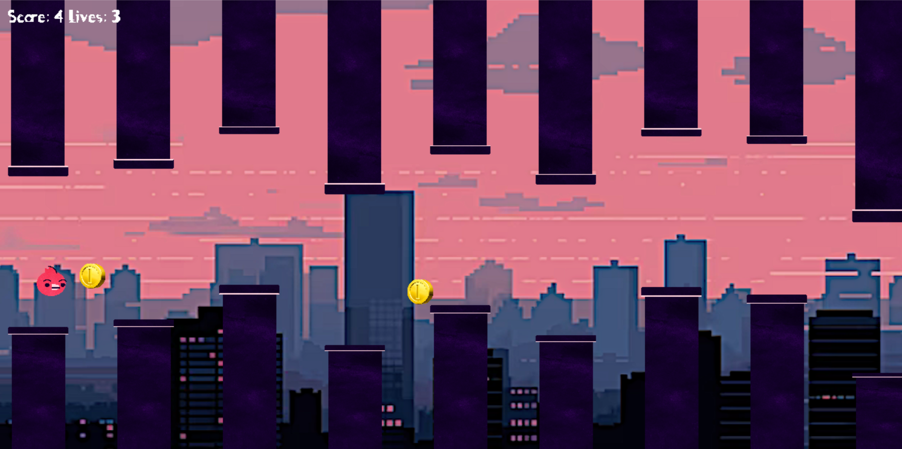
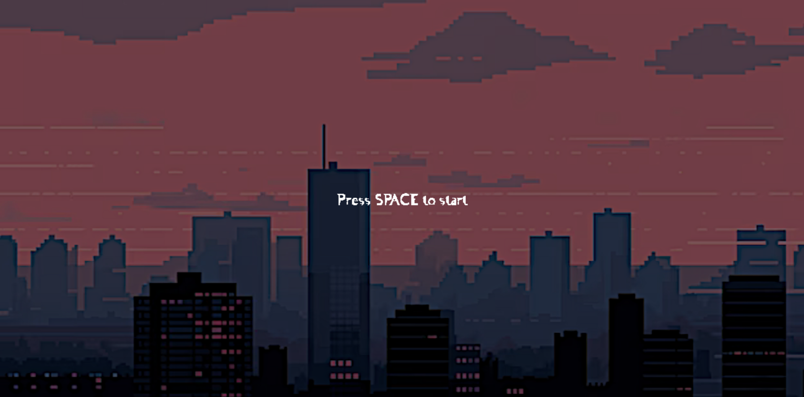
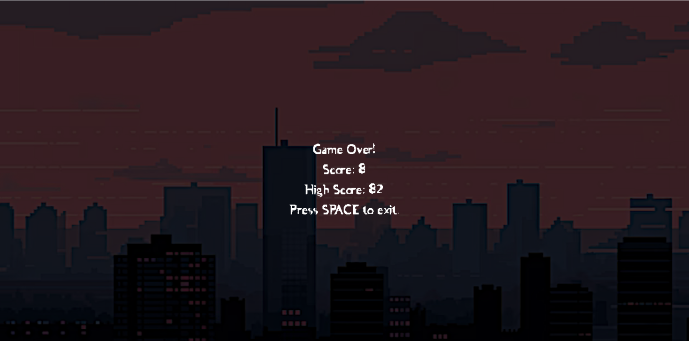

# Flappy Bird Game

Flappy Bird is a popular game where the player controls a bird, navigating it through gaps between green pipes without hitting them. This project recreates the classic game for PC, with additional features such as power-ups and custom graphics.

## About the Project

Flappy Bird is a popular game where the player controls a bird, navigating it through gaps between green pipes without hitting them. This project recreates the classic game for PC, with additional features such as power-ups and custom graphics. We've implemented several enhancements, including coin power-ups that provide extra points and a lives system where the player starts with 4 lives, adding an extra layer of challenge and strategy to the gameplay.



## Technologies Used
- **Language:** C++ (Visual Studio)
- **Graphics Library:** SDL (Simple DirectMedia Layer)
- **Font:** Asman Font

## Data Structures Used
- **Doubly Linked List:** Used for generating pipes displayed as the game progresses.
- **Dynamic Vectors:** Used for generating pop-up coins during the game.

## Game Features
- **Bird Instance Creation:** Initiates the bird character in the game.
- **Pipe Rendering:** Displays pipes dynamically as the game progresses.
- **Start and Game Over Screens:** Provides screens to start the game and show the final score.
- **Collision Handling:** Manages bird collisions with pipes and other obstacles.
- **Score Tracking:** Keeps track of the current and high scores.
- **Power-ups:** Introduces coins appearing between pipes for extra points.
- **Game States:** Manages the bird's life and score based on player performance.

## Installation

Follow these steps to set up and run the game on your computer:

1. **Clone the Repository:**
   ```bash
   git clone https://github.com/masuma131/Flappy-Bird-Game.git
   cd Flappy-Bird-Game
   ```
2. **Set Up SDL Library**

- Follow the SDL setup guide: [SDL Setup Guide](https://www.sfml-dev.org/tutorials/2.6/start-vc.php)
- Alternatively, use the [Lazy Foo SDL Tutorial](https://lazyfoo.net/tutorials/SDL/01_hello_SDL/windows/msvc2019/index.php).

3. **Additional Setup**

- **Loading Images:** [Setup Images](https://lazyfoo.net/tutorials/SDL/06_extension_libraries_and_loading_other_image_formats/windows/msvc2019/index.php)
- **Font Setup:** [Setup Fonts](https://lazyfoo.net/tutorials/SDL/16_true_type_fonts/index.php)
- **Sound Setup:** [Setup Sound](https://lazyfoo.net/tutorials/SDL/21_sound_effects_and_music/index.php)

4. **Build and Run**

- Open the project in Visual Studio, build it, and run.

## How to Play

- Press the **spacebar** to make the bird fly.
- Navigate through the pipes without hitting them or the ground.
- Collect coins to gain extra points.
- Try to achieve the highest score possible.

## Team Contributers
- Masuma Begum
- Mary-Anne Ibeh
- Chloe Quijano

## Screenshots
### Start Screen

### Gameplay Screen

### End Screen


## References

- **Repository of Code:** [Flappy Bird Game](https://github.com/masuma131/Flappy-Bird-Game)
- **Graphics Library:** [SDL](https://www.libsdl.org/)
- **Font:** [Asman Font](https://www.dafont.com/fr/asman.font)
- **Setup Guide:** [SFML Setup](https://www.sfml-dev.org/tutorials/2.6/start-vc.php)
- **SDL Setup Tutorial:** [Lazy Foo SDL Tutorial](https://lazyfoo.net/tutorials/SDL/01_hello_SDL/windows/msvc2019/index.php)
- **Setup Images:** [Loading Other Image Formats](https://lazyfoo.net/tutorials/SDL/06_extension_libraries_and_loading_other_image_formats/windows/msvc2019/index.php)
- **Setup Fonts:** [Using TrueType Fonts](https://lazyfoo.net/tutorials/SDL/16_true_type_fonts/index.php)
- **Setup Sound:** [Sound Effects and Music](https://lazyfoo.net/tutorials/SDL/21_sound_effects_and_music/index.php)

